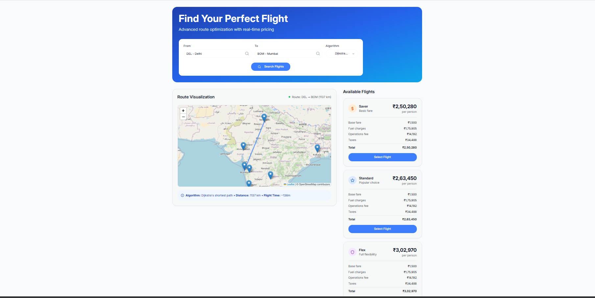

# ✈️ SkyBooker

A modern flight booking application with advanced route optimization and real-time pricing. Built with **React**, **Express**, and **PostgreSQL**, SkyBooker delivers intelligent routing, dynamic fare computation, and interactive user experiences.

---

## 🚀 Features

- **Smart Route Planning**  
  Implements Dijkstra's, Bellman-Ford, A*, and Floyd-Warshall algorithms for optimal flight path computation.

- **Real-time Pricing**  
  Dynamic fare calculation based on fuel costs, demand, and operational factors.

- **Interactive Maps**  
  Visualize flight routes and airport connections using Leaflet integration.

- **User Authentication**  
  Secure JWT-based authentication system with rate limiting and middleware protection.

- **WebSocket Updates**  
  Real-time notifications for price changes and route updates.

---

## 🧰 Tech Stack

### Frontend

- React 18 + TypeScript
- Tailwind CSS for styling
- React Query (TanStack Query) for efficient data fetching
- Wouter for lightweight routing
- Leaflet for map visualization
- Radix UI for accessible components

### Backend

- Node.js with Express
- TypeScript
- PostgreSQL with Drizzle ORM
- WebSocket support for live updates
- JWT authentication
- Security middleware and rate limiting

---

## 🧭 Route Algorithms

SkyBooker models the flight network as a graph of airports connected by routes. It supports:

| Algorithm         | Purpose                                      |
|------------------|----------------------------------------------|
| Dijkstra's        | Shortest path by total distance              |
| A* Search         | Heuristic-based optimized pathfinding        |
| Bellman-Ford      | Handles negative weights and dynamic graphs  |
| Floyd-Warshall    | Finds the shortest paths between all pairs of nodes |

---

## 💸 Pricing Model

Dynamic pricing is calculated based on:

- **Base Fare** per route
- **Fuel Costs**: ₹/liter × aircraft consumption rate
- **Operational Fees** and taxes
- **Demand-Based Adjustments**
- **Fare Classes**: Saver, Standard, Flex
---